# CryptoCurrency Bot

## Описание
Telegram-бот для отслеживания текущей цены для некоторой криптовалюты, изменения цены за некоторый период, подсчета текущей цены портфеля пользователя.

## Ссылки
[](https://hub.docker.com/repository/docker/mcherepnov/crypto-telegram-bot/general)

[](https://t.me/Crypto_Currency_BitX_bot)
## Технологичексий стек
- Язык: **Java 23**
- Cборка и управление зависимостями: **Gradle 8.14**
- База данных:  **MongoDB 8.0.8**
- Фреймворк: **Spring 6.2.3**
- Логирование: **SLf4J 2.0.9**
- Брокер сообщений: **Apache Kafka 3.7.0**
- Развертывание и контейнеризация: **Docker-desktop**
- Инструменты:
  - **Spring Data MongoDB 4.2.0**
  - **Spring WebFlux 6.2.3**
  - **Spring Modulith**
  - **Jackson 2.15.2**
  - **Lombok: 1.18.30**
- Тестирование:
  - **Spring test 6.1.3**
  - **Junit 4.13.2**

## Команды бота и дополнительная функциональность

### Общие команды

| №  | Команда | Описание |
|----|---------|----------|
| 1  | `/start` | Инициализация бота |
| 2  | `/help` | Вывод описания функций и соответствующих им команд |

### Настройка бота
| №  | Команда | Описание |
|----|---------|----------|
| 3  | `/set_fiat <валюта>` | Выбор фиатной валюты по умолчанию |
| 4  | `/set_crypto <криптовалюта>` | Выбор криптовалюты по умолчанию |

### Анализ биржи
| №  | Команда | Описание |
|----|---------|----------|
| 5  | `/compare_сurrency <валюта 1> <валюта 2> <период>` | Сравнение цен двух криптовалют за указанный период |
| 6  | `/show_current_price` | Показать текущую цену криптовалюты по умолчанию |
| 7  | `/show_price_history <период>` | Показать историю цен криптовалюты по умолчанию за период |

### Работа с портфелем
| №  | Команда | Описание |
|----|---------|----------|
| 8  | `/add <количество> <валюта>` | Добавление указанного количества валюты в портфель |
| 9  | `/set_alert_EMA <валюта>` | Установить оповещение по индикатору EMA |
| 9  | `/set_alert_VAL <валюта> <макс_цена> <мин_цена>` | Установить оповещение по значению цены |
| 10  | `/set_alert_PERC <валюта> <макс_рост%> <макс_падение%>` | Установить оповещение по процентному изменению |
| 11 | `/portfolio` | Просмотр портфеля |
| 12 | `/get_portfolio_price` | Отслеживание цены портфеля за указанный период |
| 13 | `/get_assets_price` | Показать убыток/прибыль по каждой криптовалюте в портфеле |

### Работа с алертами
| №  | Команда | Описание |
|----|---------|----------|
| 14 | `/my_alerts` | Показать активные оповещения |
| 15 | `/delete_alert_<тип> <валюта>` | Удалить активное оповещение по типу и валюте |
| 16 | `/delete_all_alerts` | Удаление всех оповещений |


### Информация об авторах
| №  | Команда | Описание |
|----|---------|----------|
| 17 | `/authors` | Вывод списка авторов |

### Администрирование и проверка состояния бота
| №  | Команда | Описание |
|----|---------|----------|
| 18 | `curl -X GET http://localhost:8080/healthcheck` | Проверка состояния (healthcheck)|
| 19 | `curl -X GET \  http://localhost:8080/admin/users \  -H "Authorization: Bearer YOUR_API_KEY_HERE"` | Авторизация и получение списка пользователей администратором|
| 20 |` curl -X GET \ http://localhost:8080/admin/logs \  -H "Authorization: Bearer YOUR_API_KEY_HERE"` | Авторизация и получение логов приложения администратором|


## Установка и запуск

### Локальная установка

1. Перед установкой убедитесь в соответствии требованиям:
  - Язык: **Java 23**
  - БД: **MongoDB 8.0.8**
  - Gradle **8.14**

2. Для установки клонируйте репозиторий:
    ```bash
    git clone https://github.com/pmlobanov/JavaSpring_CryptoCurrencyBot
    cd JavaSpring_CryptoCurrencyBot
    ```
3. Создайте такой файл .env и поместить его в корень проекта:
    ```
    # Существующие переменные MongoDB
    MONGO_INITDB_ROOT_USERNAME=YOURROOTUSERNAME
    MONGO_INITDB_ROOT_PASSWORD=YOURROOTUSERPASSWORD
    MONGO_INITDB_DATABASE=BitBotDB
    
    # Новые переменные для Vault
    VAULT_DEV_ROOT_TOKEN_ID=YOURROOTUSERTOKENID
    VAULT_ADDR=http://vault:8200
    VAULT_TOKEN=YOURROOTTOKEN
    ```
4. Отчистите и пересоздайте файл fatJar командой:
    ```bash
    ./gradlew clean fatJar
    ```
4. Запустите все сервисы, необходимые для приложения:
   ```docker-compose up -d --build```
5. Остановка приложения:
    ```bash
    docker-compose down
    ```


### 🐳 Запуск через Docker Hub

### Необходимые условия:
- Установленный [Docker](https://docs.docker.com/get-docker/)
- Установленный [Docker Compose](https://docs.docker.com/compose/install/)

### Пошаговая инструкция:

1. **Создайте рабочую директорию**:
   ```bash
   mkdir crypto-bot && cd crypto-bot
2. **Скачайте образ из Docker Hub:**
    ```bash
    docker pull mcherepnov/crypto-telegram-bot:latest
    ```
3. **Настройте окружение:**

   Создайте файл .env и заполните его (аналогично установки с GitHub)
  1. **Инициализация MongoDB:**
     Скачайте файл инициализации: `mongo-init.js`
  2. **Настройка Vault:**
     Вставьте в скрипт vault-init.sh требуемые секреты

4. **Настройка docker-compose.yml:**

   Скачайте оригинальный файл: `docker-compose.yml`

   Измените секцию app:

    ```yaml
    app:
    image: mcherepnov/crypto-telegram-bot:latest
    # Удалите или закомментируйте секцию build
   ```
5. Запустите приложение:
    ```bash
    docker-compose up -d
    ```
6. Проверка работы:
    ```bash
    docker-compose logs -f app
    ```
7. Остановка приложения:
    ```bash
    docker-compose down
    ```

## Структура проекта
Приложение организовано в виде набора модулей в соответствии с модульной архитектурой Spring Modulith. Каждый модуль соответствует подпакету в ru.spbstu.mcs.telegramBot и направлен на обслуживание определенной части бота:

- `Server` (Сервер):
  - `ServerApp`: Основной файл приложения сервера, который запускает и управляет сервером.
  - `AppConfigurations`: Конфигурации приложения, которые включают в себя настройки базы данных, API ключи и другие параметры.
- `Config` (Конфигурация):
  - `LoggingConfig`: Конфигурация логирования, определяющая, как и куда будут записываться логи приложения.
  - `SchedulingConfig`: Конфигурация задач по расписанию, например, для периодического выполнения определенных операций.
  - `VaultConfig`: Конфигурация для работы с хранилищем секретов, таких как пароли и ключи API.
- `Service` (Сервис):
  - `AlertsHandling`: Обработка оповещений и уведомлений.
  - `BotCommand`: Обработка команд бота.
  - `KafkaConsumerService`: Сервис для потребления сообщений из Kafka.
  - `KafkaProducerService`: Сервис для отправки сообщений в Kafka.
  - `TelegramBotService`: Основной сервис для взаимодействия с Telegram API.
- `CryptoApi` (Крипто API):
  - `CryptoInformation`: Сервис для выполнения финансовых расчетов и мониторинга цен криптовалют. Предоставляет функциональность для сравнения валютных пар и получения истории цен
  - `CryptoPortfolioManager`: Сервис для управления криптовалютным портфелем пользователя.
  - `CurrencyConverter`: Сервис для получения курсов фиатных валют.
  - `PriceFetcher`: Сервис для получения цен с биржи BingX
- `DB` (База данных):
  - `DTO` (Data Transfer Objects): Объекты для передачи данных между слоями приложения.
    - `UserPortfolioView`: Представление портфеля пользователя.
  - `encryption`: Объекты для шифрования ключей для авторизации администраторов
    - `KeyLoader`: Загрузчик ключей.
    - `PrivateKeyProvider`: Поставщик приватных ключей.
    - `RsaCryptor`: Шифрование и дешифрование с использованием RSA.
    - `RsaKeyGenerator`: Генератор RSA ключей.
  - `Repositories`: Репозитории для доступа к данным в базе данных.
    - `AdminRepository`: Репозиторий для данных об администраторах.
    - `NotificationRepository`: Репозиторий для уведомлений.
    - `PortfolioRepository`: Репозиторий для данных портфелей.
    - `UserRepository`: Репозиторий для данных пользователей.
  - `Services`: Сервисы для работы с базой данных.
    - `AdminService`: Сервис для операция с данными администраторов.
    - `ApiKeyService`: Сервис для управления API ключами.
    - `NotificationService`: Сервис для управления уведомлениями.
    - `PortfolioService`: Сервис для управления портфелями.
    - `UserService`: Сервис для управления пользователями.
- `Model` (Модель):
  - `Admin`: Модель данных для администратора.
  - `Currency`: Модель данных для валют.
  - `Notification`: Модель данных для уведомлений.
  - `Portfolio`: Модель данных для портфелей.
  - `User`: Модель данных для пользователей.
- `Security` (Безопасность):
  - `EncryptionService`: Сервис для шифрования данных.
  - `KeyGenerator`: Генератор ключей.
- `Util` (Утилиты):
  - `ChatIDMasker `: утилитный класс для маскирования ID чатов в логах
- `Application `: Само приложение

### Диаграмма связи модулей:
<p align="center">
  
</p>

[📚 **Полная документация**](https://htmlpreview.github.io/?https://github.com/pmlobanov/JavaSpring_CryptoCurrencyBot/blob/main/docs/moduleDocs.html)

## Демонстрация работы бота:
<div align="center">
  <table>
    <!-- Первый ряд -->
    <tr>
      <td align="center">
        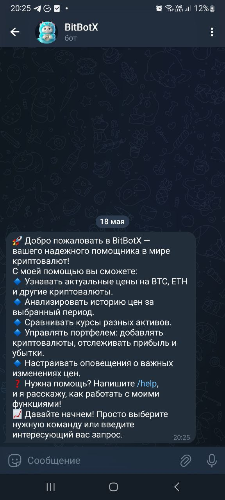
        <br><em>Рис. 1: Команда /start. Приветственное сообщение бота.</em>
      </td>
      <td align="center">
        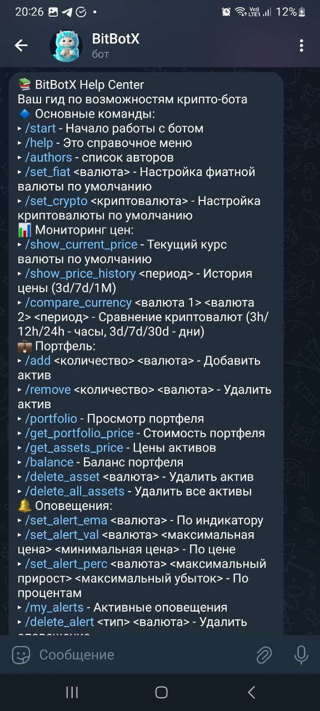
        <br><em>Рис. 2: Команда /help</em>
      </td>
    </tr>
    <!-- Второй ряд -->
    <tr>
      <td align="center">
        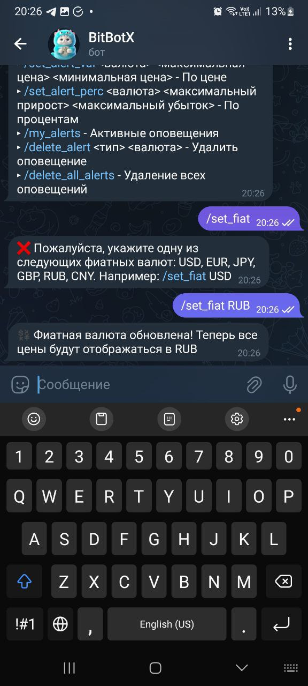
        <br><em>Рис. 3: Команда /set_fiat</em>
      </td>
      <td align="center">
        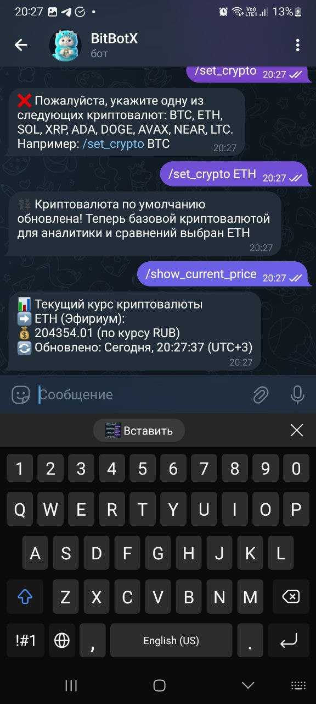
        <br><em>Рис. 4: Команды взаимодействия с криптовалютой по умолчанию</em>
      </td>
    </tr>
    <!-- Третий ряд -->
    <tr>
      <td align="center">
        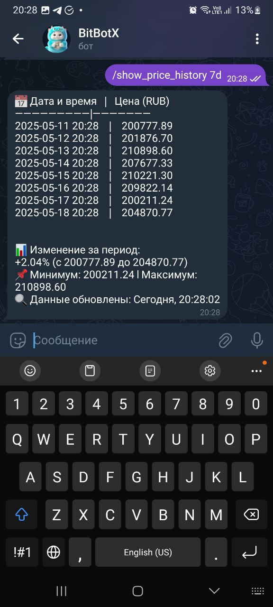
        <br><em>Рис. 5: Изменение криптовалюты по умолчанию за 7 дней</em>
      </td>
      <td align="center">
        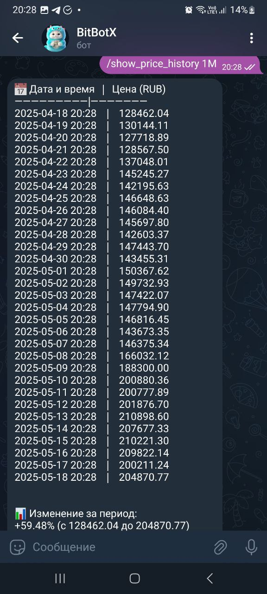
        <br><em>Рис. 6: Изменение криптовалюты за месяц</em>
      </td>
    </tr>
    <!-- Четвертый ряд -->
    <tr>
      <td align="center">
        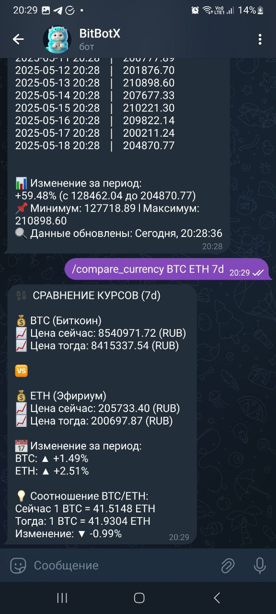
        <br><em>Рис. 7: Сравнение цен криптовалют</em>
      </td>
      <td align="center">
        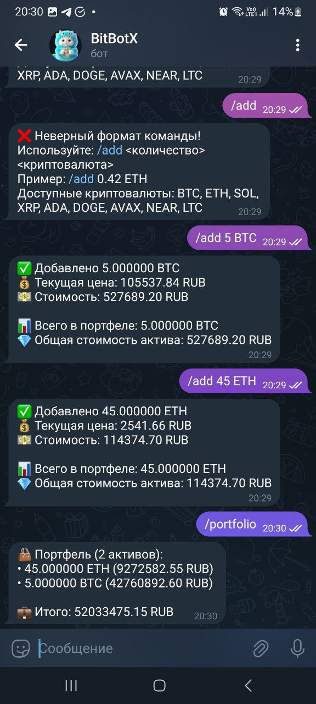
        <br><em>Рис. 8: Добавление активов в портфель</em>
      </td>
    </tr>
    <!-- Пятый ряд -->
    <tr>
      <td align="center">
        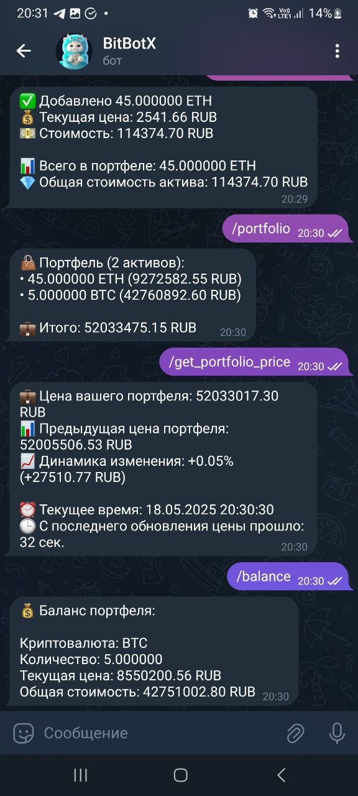
        <br><em>Рис. 9: Информация о портфеле</em>
      </td>
      <td align="center">
        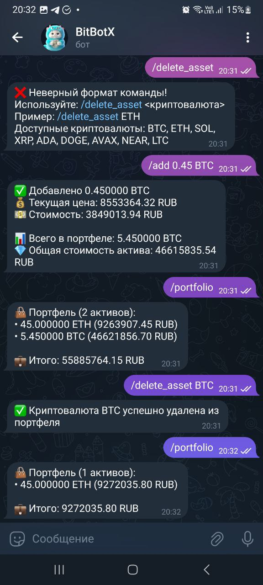
        <br><em>Рис. 10: Удаление актива из портфеля</em>
      </td>
    </tr>
    <!-- Шестой ряд -->
    <tr>
      <td align="center">
        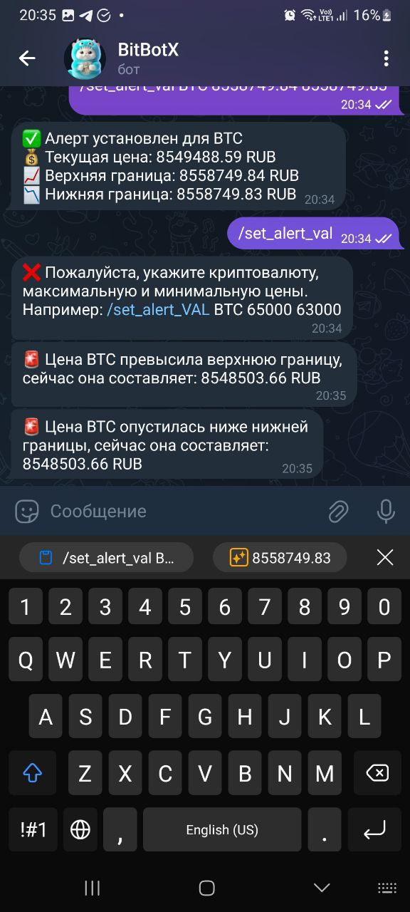
        <br><em>Рис. 11: Срабатывание уведомления</em>
      </td>
      <td align="center">
        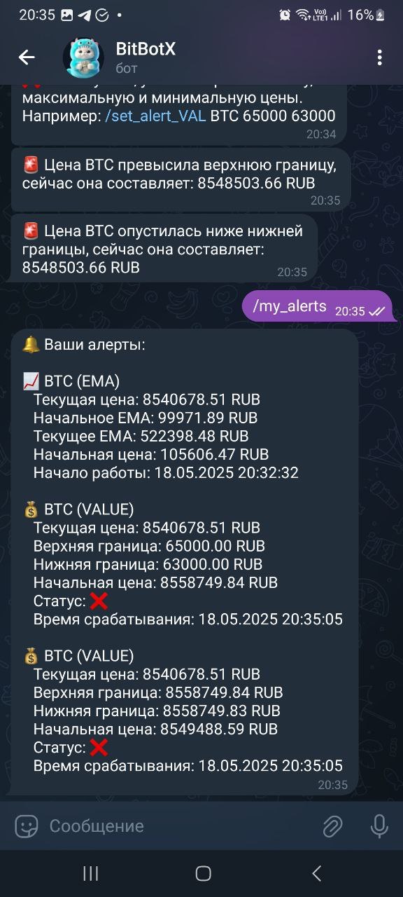
        <br><em>Рис. 12: Список уведомлений</em>
      </td>
    </tr>
    <!-- Седьмой ряд (одиночная картинка) -->
    <tr>
      <td align="center" colspan="2">
        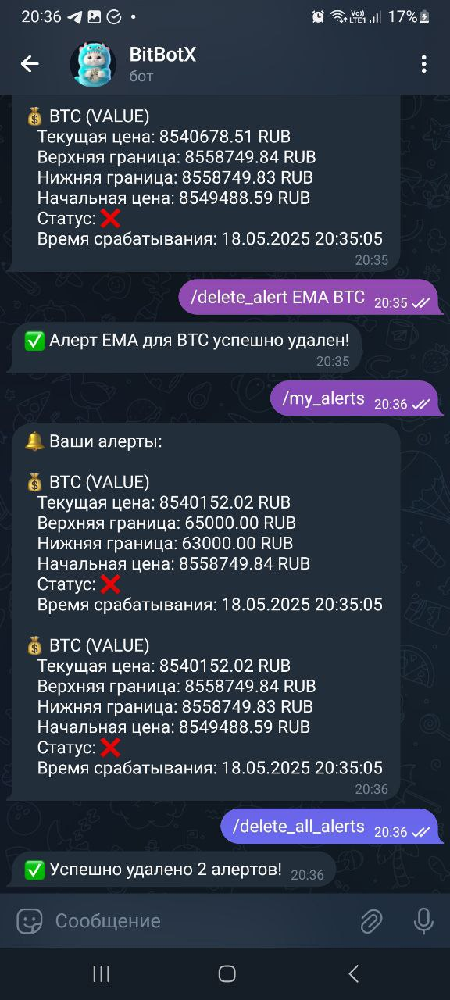
        <br><em>Рис. 13: Удаление всех уведомлений</em>
      </td>
    </tr>
  </table>
</div>

## Команда
- Черепнов Максим 5130201/20101
- Чурова Софья 5130201/20101
- Лобанов Павел 5130201/20101

## Описание коммитов
| Название | Описание                                                        |
|----------|-----------------------------------------------------------------|
| docs	   | Обновление документации                                         |
| feat	   | Добавление нового функционала                                   |
| fix	     | Исправление ошибок                                              |
| refactor | Правки кода без исправления ошибок или добавления новых функций |
| revert   | Откат на предыдущие коммиты                                     |
| style	   | Правки по кодстайлу (табы, отступы, точки, запятые и т.д.)      |

